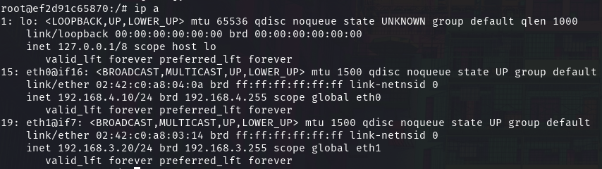

# Introduction

This documentation aims to showcase the capabilities of our DockerSec environment by presenting different exercises involving tasks of system administration for beginners. All you need is access to a system with Docker installed and the `docker-compose.yml` file. Execute the command `docker compose up -d` and patiently wait for the setup to complete.

To open a terminal in a Docker container, use the command `docker exec -it <container-name> /bin/bash`. To list container names, execute `docker ps` and find them in the leftmost column under the `NAMES` heading.

Always refer to the provided diagram of the environment to gain a comprehensive understanding of the network configurations.

\newpage

# Diagram


\newpage

# Firewalls and Routing

For this project, we are using Ubuntu based routers with `iptables` for firewall and NAT, and `ip route` for routing. Because the container we provided have system capabilities to forward the ipv4 packets, they act like a router.

## IPTables

### Setting rules
`iptables` is powerful tool to manage firewall rules on a linux system, as it is only CLI, it is widely used on servers. The `iptables` have three main categories:

* INPUT
* FORWARD
* OUTPUT

In this docker simulation, we use only FORWARD rules for firewall. Therefore, we will mainly set only such rules during the exercises, but the rules are almost identical between categories.

#### Questions

1. Connect to DMZ_Router_External and find a way to print the firewall rules. Optionnal: Print detailed firewall rules.
2. Show the NAT rules set in iptables
3. Create an INPUT rule to allow http service

\newpage
#### Answers

1. To show the firewall rules on the router, we can use the command `iptables -L`, and if we want detailed rules, we can upgrade the verbosity using `-v`:
	
	

	
	
2. The NAT rules are not showed with previous command, you need to add the parameter `-t nat`. Which will print the nat rules like follow:
	
	
	The `DOCKER_*` categories are specific to the setup environment, meaning you won't normally find it anywere else. We can see that `POSTROUTING` is set on the interfaces of the router, meaning we have NAT rules !

3. To create an INPUT to allow http service, you need to run the following: 
	
	```bash
		iptables -A INPUT -p tcp --dport 80 -j ACCEPT
	```
	Explanation of the options used:
	
	* `-A INPUT`: Appends a rule to the INPUT chain.
	* `-p tcp`: Specifies the protocol as TCP.
	* `--dport 80`: Specifies the destination port as 80 (HTTP).
	* `-j ACCEPT`: Specifies the target action as ACCEPT.
	You can use the command from question 1 to see if the rule is set !

### Setting a stateful firewall

If you check again the output of `iptables -L`, you might notice that some rules have a `ctstate` writen. This meaning that the firewall will be applying a stateful rule using `conntrack`. Connection tracking is the main difference between what we call a stateless firewall and a stateful firewall. 

With a stateless firewall, when a connection is esthablished, the firewall will check its source and destination, go through the firewall rules and then allow the connection. But with a stateful firewall, the firewall will keep track of the connection state and therefore detect if it is a new connection attempt or a part of an established one. 

The stateful firewall is more secured and has better performance, therefore it is recommended to use it ! With `iptables`, it is very simple to set a stateful rule, we just need to add the parameter `--cstate <flag>`. Usually, we use the flags `ESTABLISHED`, `NEW` or `RELATED`.

Let's change the http rule we had set before, to do so, we need to first delete the input rule we made:
```bash
iptables -D INPUT 1
```
Then, we add the flags `ESTABLISHED` and `NEW`, which will allow us to create new connection but also to track the established ones:
```bash
	iptables -A INPUT -p tcp --dport 80 -m conntrack --ctstate NEW,ESTABLISHED -j ACCEPT
```

### Save rules

All the rules we have set since now are not persistent, meaning that if the machine restart, it will be lost. Therefore, they many ways to save them and restore them, but we will detail one.

1. Save the rules in a file using `iptables-save > /etc/iptables/rules.v4`
2. Set a cron task at reboot that will run the following `iptables-restore < /etc/iptables/rules.v4`

Therefore, using `iptables-save` and `iptables-restore`, you can backup and restore your configuration. If you make a mistake of configuration or you are doing some testing, this is very useful in order to avoid service disruptions.

## IP routes

In order to some routing on ubuntu system, we decided to use `ip route`. This set of command is helpful to set route path to subnets, the default gateway, get stats from a route path and so on.

First of all, we will show the `ip route` set on the DMZ_Router_External, let's connect to it and run the following: 
```bash
ip route show
```

Here is the result: 

### Questions

1. What is the default gateway on the router ?
2. Which interface is used to access the subnet `192.168.3.0/24` ?
3. Find a way to show the ip address of the machine

\newpage

### Answers

1. The default gateway is written on the first line as `default via 192.168.4.1 dev eth0`. Which means that `192.168.4.1` is the default gateway address of the router and is located on interface `eth0`.
2. Reading the output of `ip route show`, we can see that the interface responsible of `192.168.3.0/24` is `eth1`.  We can see for other subnets that the path is specified `via`, which means it will get to an IP address to reach the requested subnet!
3. In order to show the ip address of the machine, you can simply run `ip a`
	
	
	You can read the ip address on `inet` for each interface ! You can even read the MAC address on `link/ether`.

## Troubleshooting

IP routes are not parameters that you will set a lot. Usually you set them once at the initial setup and that's it, you might update them if you changed your router config but it is rare. Also, on sophisticated routers, you don't even need to go on each machines to set the ip routes because they will provide them. On our setup, we had to set them as we are in a docker environment.

The gateway will be set either manually, either by the DHCP server, therefore mistakes can happen. If you notice issues in terms of connections, you can try to ping networks using `ping <ip>`. But also using ip routes, you can see if the route is cached or not, using `ip route get <ip>`. This command is similar to `traceroute <ip>`.

Let's try the previous commands on the DMZ_Router_External.

One issue can be a missing route to a network, to add them, you can run  `ip route add [destination] via [gatewayIP]`. And to delete them `ip route del [destination] via [gatewayIP]`. If you wanna change the default gateway, simply run `ip route add default via [gateway]`.


# Services

In this docker simulation, we are a running  three main services: web server, a domain name server and a DHCP server.

## HTTP

This server is hosting an HTTP server running a javascript website using NodeJS. Therefore, we can see the service running using different commands.

At first, we see if the port 80 is currently used using `ss -tlpn`:


We can read a state LISTEN on the port `*:80` , we can even read the Process ID of node. Speaking of process, we can check if the process is running fine using `ps -aux`:


Therefore we can see which command was used to start the website ! And also, we can use `kill <pid>` to stop the service from running. But as we can read the command, we can simply restart it.

If you want a more interactive way to show the process, you can run `top` command.

### Question

1. Can you find the logs related to the access of the website ?

\newpage

### Answers

1. In order to find the logs, we can run an `ls` command in the folder `/juice-shop` and notice a folder called `logs` containing the requested logs. But what if we wanted to find them located in another folder ?
	We can run a ` find / -name "*access*log*"` in order to find them !

	


## DNS

As you can see on the diagram of the project, we have a DNS server inside the DMZ. Therefore, we will use its configuration files in order to understand how it is set!

### Bind9

To have a DNS server, we need a service and to do so, we use Bind9, also called "named". Using the `ps -aux` or `top` commands, you can see it running !

The DNS configuration files will be stored in `/etc/bind/` :


In this folder we need to focus on three files at the moment:

* `named.conf.options`
* `named.conf.local`
* `/zones/juice-shop.local`

Each file ending on `.local` is a zone file, which will be detailed in the next part ! Let's read the content of `named.conf.options` using `cat`:


Here, we can read the options currently set for the DNS server we are running. One of the most important option is `forwarders` because it allows the DNS server to query another DNS server if the request domain isn't known.

#### Questions

1. Find who's forwarder is `8.8.8.8`
2. Find another famous forwarder and set it. How can you restart the service for the setting to apply ? 

\newpage

#### Answers

1. `8.8.8.8` is the DNS of google !
2. Another famous is DNS is `1.1.1.1`. After editing the file using `vim`, you can restart the service using `service named restart`:
	
	
	As you can read `[ OK ]`, it means the service restarted properly and you didn't made any mistake on the forwarder change !

### Zones 

In the context of DNS, a zone refers to a portion of the domain namespace for which a particular DNS server is responsible. Each zone contains information about the domain names within that space and their associated resource records.

Let's explore the contents of the `named.conf.local` file to understand how zones are configured. Use the `cat` command to view the file:
```bash
cat /etc/bind/named.conf.local
```

This file typically includes statements for defining zone configurations:
```bash
zone "juiceshop.local" {
    type master;
    file "/etc/bind/zones/juiceshop.local";
};
```
This snippet indicates that there is a zone named "juiceshop.local," and the associated information is stored in the file `/etc/bind/zones/juiceshop.local`. The `type master;` statement signifies that this DNS server is authoritative for the zone.

Now, let's examine the contents of a sample zone file, such as `/etc/bind/zones/juiceshop.local`. You can use the `cat` command to display the file:
```bash
cat /etc/bind/zones/juice-shop.local
```

A zone file typically includes various resource records (RRs) that provide information about the domain. Common types of RRs include:

- **SOA (Start of Authority):** Provides authoritative information about the domain and the zone.
- **NS (Name Server):** Specifies authoritative DNS servers for the domain.
- **A (Address):** Maps a domain to an IPv4 address.
- **AAAA (IPv6 Address):** Maps a domain to an IPv6 address.
- **CNAME (Canonical Name):** Creates an alias for a domain.
- **MX (Mail Exchange):** Specifies mail servers for the domain.

Here's the zone file of juiceshop:
```bash
$TTL 1D
@       IN      SOA     ns1.juiceshop.local. admin.juiceshop.local. (
                2023111601 ; Serial
                3H ; Refresh
                15 ; Retry
                1w ; Expire
                3h ; Negative Cache TTL
);

@       IN      NS      ns1.juiceshop.local.
@       IN      A       192.168.3.12
www     IN      A       192.168.3.12
ns1     IN      A       192.168.3.13

```


#### Question

1. Create a zone for `example.com` and use `traceroute example.com` to show the proper configuration.

\newpage

#### Answer

1. To create zone for example.com, you first need to create a zone file :
	
	```bash
		nano /etc/bind/zones/example.com
	```
	Then you will edit the file as follow:

	```bash
		$TTL 1D
		@       IN      SOA     ns1.example.com. admin.example.com. (
		                2023111601 ; Serial
		                3H ; Refresh
		                15 ; Retry
		                1w ; Expire
		                3h ; Negative Cache TTL
		);

		@       IN      NS      ns1.example.com.
		@       IN      A       192.168.4.3
		www     IN      A       192.168.4.3
		ns1     IN      A       192.168.4.3
	```
	Saving and exiting the file, you will now add the zone entry into `/etc/bind/named.conf.local`

	```bash
		zone "example.com" {
		    type master;
		    file "/etc/bind/zones/example.com";
		};
	```
	Now you just have to restart the service using `service named restart` and check the output of `traceroute example.com`:

	

	The IP is the one we have set into the DNS configuration, therefore it is now working !

## DHCP

If you pay attention to the diagram, you might see that the DHCP server is not located into the DMZ, because it should not be accessible from the outside ! Therefore, we have less strict firewall rules when accessing PC1 from DHCP server.

The DHCP server will be using package called `isc-dhcp-server`, which we will be the DHCP service ! It has two main files:

* `/etc/dhcp/dhcpd.conf`
* `/etc/default/isc-dhcp-server`

Let's start with `/etc/default/isc-dhcp-server`, check its content using `cat` command.
```bash
INTERFACESv4="eth0"
INTERFACESv6=""
```

You might notice a lot of comments and only one parameter set. This parameter specify which interface the DHCP server should listen for DHCP requests of new devices!

Now, let's check `/etc/dhcp/dhcpd.conf` with `cat` command:
```bash
# option definitions common to all supported network
subnet 192.168.2.0 netmask 255.255.255.0 {
}
subnet 192.168.1.0 netmask 255.255.255.0 {
    range 192.168.1.2 192.168.1.20;
    option routers 192.168.1.10;
    option domain-name-servers 192.168.3.13;
    option domain-name "dockersec.com"; 
    option broadcast-address 192.168.1.255;
    default-lease-time 600;
    max-lease-time 7200;
}
```

Once again, you might notice plenty of comments, but let's focus on this part. As you can see we have two subnets with a netmask. From the different options on `192.168.1.0`, we can read the following:

* `range 192.168.1.2 192.168.1.20;` --> this is the IP range we will give to the devices connecting to this subnet.
* `option routers 192.168.1.10;` --> that will define the default gateway of the device.
*  `option domain-name-servers 192.168.3.13;` & `option domain-name "dockersec.com";` --> these are responsible of the DNS configuration and will specify the DNS server IP and name !
* `option broadcast-address 192.168.1.255;` --> we need to know which ip to use for broadcasts.
* `default-lease-time 600;` &  `max-lease-time 7200;` --> this will define in seconds how long a DHCP lease will be set for, so how long our device will have the IP set.

### Questions
1. How can you extend the IP range from 19 IPs to 40 ?
2. How to restart the service ?

\newpage

### Answers
1. To extend the IP range, you need to change the ligne `range 192.168.1.2 192.168.1.20;` to  `range 192.168.1.2 192.168.1.41;` for example.
2. You need to run `service isc-dhcp-server restart` :

	

